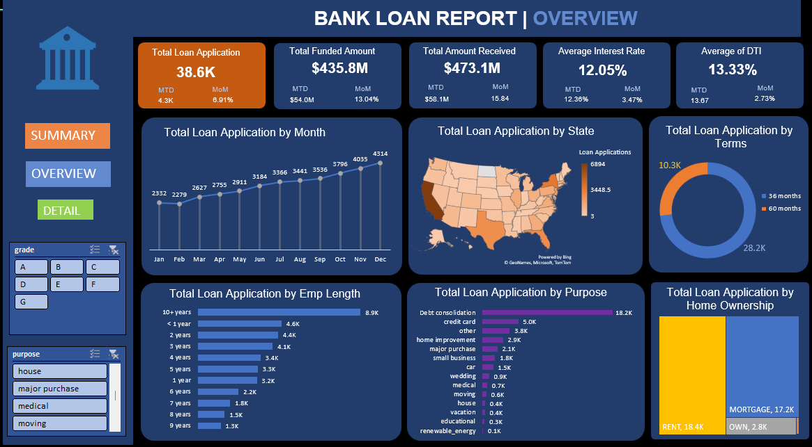
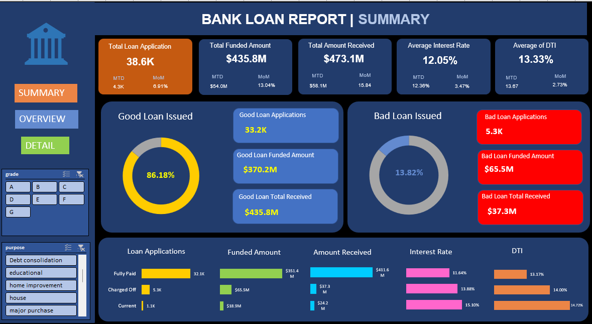

# 📊 Bank Loan Analysis Dashboard (Excel)

##  Project Overview
This project analyzes **38,000+ bank loan applications** to uncover trends in loan performance, borrower behavior, and risk patterns.  
It features **two interactive Excel dashboards** for a comprehensive view:

1. **Overview Dashboard** – Tracks loan application trends, funded amounts, interest rates, and borrower demographics.
2. **Summary Dashboard** – Compares good vs. bad loans, repayment trends, and key loan performance metrics.

---

## Key Insights
- **Total Loan Applications:** 38.6K | **Total Funded Amount:** $435.8M | **Total Amount Received:** $473.1M  
- **Good Loans:** 86.18% of total applications  
- **Bad Loans:** 13.82% of total applications  
- Loan terms are dominated by **36 months (28.2K)** over **60 months (10.3K)**  
- **Debt Consolidation** is the top loan purpose with 18.2K applications  
- States like **California, Texas, and Florida** lead in loan applications  
- Peak loan applications occur in **December**, lowest in **February**

---

## Project Files
- [Banking_Loan_Project.xlsx](https://github.com/SapnaBhola/Bank_Loan_Project/blob/main/Banking_Loan_Project.xlsx) → Interactive dashboards with slicers, KPIs, and charts.
- [Overview Dashboard](https://github.com/SapnaBhola/Bank_Loan_Project/blob/main/Overview_dashboard.png) → Overview of loan trends & borrower segmentation.
- [Summary Dashboard](https://github.com/SapnaBhola/Bank_Loan_Project/blob/main/Summary_dashboard.png) → Good vs. bad loans and repayment performance.
- [Financial_loan.csv](https://github.com/SapnaBhola/Bank_Loan_Project/blob/main/Financial_loan.csv) → Cleaned & anonymized dataset used for analysis.

---

### **Overview Dashboard**

### **Summary Dashboard**

---

## Tools & Skills Used
- **Microsoft Excel**
  - PivotTables & Pivot Charts
  - Slicers for interactivity
  - KPI cards for performance tracking
  - Conditional formatting for insights
- **Data Cleaning**
  - Removal of irrelevant columns
  - Handling missing values
  - Creating calculated metrics
- **Data Analysis**
  - Loan performance tracking
  - Borrower profile segmentation
  - Trend analysis by month, state, and loan purpose

---

##  How to Use
1. Download or clone this repository.
2. Open `Banking_Loan_Project.xlsx` in **Microsoft Excel (2016 or later)** for full interactivity.
3. Use slicers to filter by:
   - Loan Grade (A–G)
   - Loan Purpose
   - Term Length
   - Home Ownership

---

## 📬 Contact
If you’d like to connect or collaborate:  
**LinkedIn:** [Sapna](https://www.linkedin.com/in/sapna-18785b287/)  
**Email:** sapna.bhola86@gmail.com
